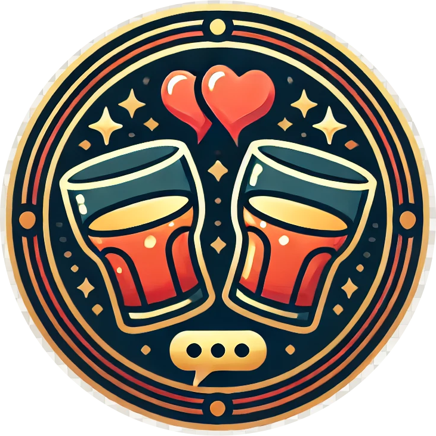

# BarMingle - The Bar-Oriented Dating App

<p align="center">
  
</p>


Welcome to **BarMingle**, an innovative dating app tailored for people to meet, chat, and connect within the vibrant setting of bars. Whether you're a manager looking to enhance the social experience in your venue or a user eager to meet new people, BarMingle has you covered with intuitive flows and engaging features.

## Features

- **User Flow**: Find and connect with others in real-time, explore menus, and send food/drinks.
- **Manager Flow**: Upload bar menus, manage seating arrangements, and monitor live interactions.
- **SignalR Capabilities**: Real-time chat and emergency alerts ensure seamless communication.

## Project Overview

This repository contains the codebase for BarMingle, built using **React Native** and **Azure** for robust, scalable performance.

Visit the [**BarMingle Landing Page**](https://yuvalmiz.github.io/iot_website/) to learn more about the project and see it in action.

## Installation

To get started locally:
1. Clone the repository.
2. Install dependencies:
   ```bash
   npm install
   ```
3. Run the app:
   ```bash
   npx expo start
   ```
For Android verify that you have a connected phone or AVD and click 'a', for web click 'w'.

